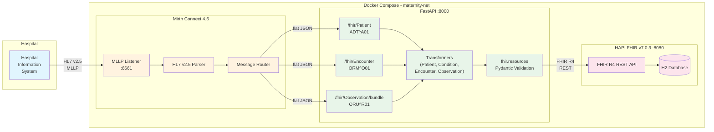

# Maternity HL7-to-FHIR Pipeline

> End-to-end HL7 v2.5 -> FHIR R4 transformation pipeline for Australian maternity care, featuring Mirth Connect integration, AU Base profile metadata, and blood pressure panel merging.

[](https://github.com/budityw23/maternity-hl7-to-fhir-pipeline/actions/workflows/ci.yml)

> **SYNTHETIC DATA ONLY** - All patient data in this repository is synthetic and generated for demonstration purposes. Not for clinical use.

## Architecture



## Data Flow

```text
Hospital HIS -> MLLP (port 6661) -> Mirth Connect -> HTTP POST -> FastAPI -> HAPI FHIR Server
                                      (parse HL7)     (transform)    (persist FHIR R4)
```

1. Hospital system sends HL7 v2.5 messages via MLLP to Mirth Connect.
2. Mirth parses HL7 segments, extracts fields, and routes flat JSON by message type.
3. FastAPI receives JSON, builds FHIR R4 resources using `fhir.resources`, and validates with Pydantic.
4. Validated resources are persisted to HAPI FHIR Server through its REST API.
5. A correlation ID tracks each message end-to-end through structured JSON logs.

## Message Types

| HL7 Message | Trigger | FHIR Resources | Key Segments |
|---|---|---|---|
| `ADT^A01` | Patient admission | Patient + Condition(s) | PID, DG1 |
| `ORM^O01` | Order placement | Encounter | PV1, ORC, OBR |
| `ORU^R01` | Observation result | Observation(s) | OBX, OBR |

### Blood Pressure Panel Merging

Consecutive OBX segments with LOINC codes `8480-6` (systolic) and `8462-4` (diastolic) are automatically merged into a single FHIR Observation with:

- Panel code `85354-9` (Blood pressure panel)
- Two `component[]` entries (systolic + diastolic)
- AU Base blood pressure profile metadata (`au-vitalsigns-bloodpressure`)
- Status set to the most conservative of the two readings
- Interpretation set from the worst-case non-normal flag

## Australian Healthcare Standards

| Standard | Detail |
|---|---|
| HL7 v2 | 2.5 |
| FHIR | R4 (4.0.1) |
| AU Base | 4.x profile URLs on Patient, Condition, Encounter, BP Observation |
| IHI | `http://ns.electronichealth.net.au/id/hi/ihi/1.0` |
| MRN | `http://hospital.local/mrn` |
| ICD-10-AM | `http://hl7.org.au/fhir/CodeSystem/icd-10-am` |
| SNOMED CT | `http://snomed.info/sct` (AU edition) |
| LOINC | `http://loinc.org` |
| UCUM | `http://unitsofmeasure.org` |

## Quick Start

### Prerequisites

- Docker and Docker Compose v2
- Python 3.11+ for local development and the MLLP test client

### Run

```bash
docker compose up --build
```

Services will be available at:

- **FastAPI**: http://localhost:8000
- **HAPI FHIR**: http://localhost:8080/fhir
- **Mirth Connect Admin**: https://localhost:8443
- **MLLP Listener**: port `6661`

### Health Check

```bash
curl http://localhost:8000/health
```

Expected response:

```json
{"status": "ok", "hapi": "up", "version": "0.1.0"}
```

## Usage Examples

### 1. Admit a Patient (`ADT^A01`)

Send via MLLP:

```bash
python scripts/mllp_send.py samples/adt_a01_normal_delivery.hl7
```

Or directly to FastAPI:

```bash
curl -s -X POST http://localhost:8000/fhir/Patient \
  -H "Content-Type: application/json" \
  -H "X-Correlation-ID: demo-001" \
  -d '{
    "correlationId": "demo-001",
    "messageType": "ADT^A01",
    "mrn": "1234567",
    "ihi": "8003608166690503",
    "name": {"family": "TEST", "given": "PATIENT", "middle": "MARY", "prefix": "MS"},
    "birthDate": "19920315",
    "gender": "F",
    "address": {"line": "14 SAMPLE ST", "city": "SYDNEY", "state": "NSW", "postalCode": "2000", "country": "AU"},
    "phone": "0412345678",
    "diagnoses": [{"code": "O80", "display": "Encounter for full-term uncomplicated delivery", "recordedDate": "20260527093000"}]
  }'
```

Example response:

```json
{"patientId": "1", "conditionIds": ["2"], "correlationId": "demo-001"}
```

### 2. Place an Order (`ORM^O01`)

```bash
python scripts/mllp_send.py samples/orm_o01_antenatal_28w.hl7
```

Or directly:

```bash
curl -s -X POST http://localhost:8000/fhir/Encounter \
  -H "Content-Type: application/json" \
  -H "X-Correlation-ID: demo-002" \
  -d '{
    "correlationId": "demo-002",
    "messageType": "ORM^O01",
    "mrn": "1234567",
    "visitNumber": "VN00001",
    "patientClass": "I",
    "admitDatetime": "20260527093000",
    "location": {"ward": "MAT_WARD", "room": "301", "facility": "RPA"},
    "attendingDoctor": {"id": "DR_SMITH", "familyName": "SMITH", "givenName": "SARAH"},
    "orderControl": "NW",
    "serviceCode": "424525001",
    "serviceDisplay": "Antenatal care"
  }'
```

### 3. Send Observations (`ORU^R01`)

```bash
python scripts/mllp_send.py samples/oru_r01_vitals.hl7
```

Or directly with a blood pressure panel:

```bash
curl -s -X POST http://localhost:8000/fhir/Observation/bundle \
  -H "Content-Type: application/json" \
  -H "X-Correlation-ID: demo-003" \
  -d '{
    "correlationId": "demo-003",
    "messageType": "ORU^R01",
    "mrn": "1234567",
    "visitNumber": "VN00001",
    "observations": [
      {"setId": 1, "code": "8480-6", "display": "Systolic BP", "value": 118, "unitCode": "mm[Hg]", "unitDisplay": "mmHg", "status": "F"},
      {"setId": 2, "code": "8462-4", "display": "Diastolic BP", "value": 76, "unitCode": "mm[Hg]", "unitDisplay": "mmHg", "status": "F"},
      {"setId": 3, "code": "29463-7", "display": "Body weight", "value": 68.5, "unitCode": "kg", "unitDisplay": "kg", "status": "F"},
      {"setId": 4, "code": "11616-0", "display": "Fetal Heart Rate", "value": 145, "unitCode": "/min", "unitDisplay": "beats/min", "status": "F"}
    ]
  }'
```

### 4. Verify in HAPI FHIR

```bash
# All patients
curl -s http://localhost:8080/fhir/Patient | python -m json.tool

# Patient by MRN
curl -s "http://localhost:8080/fhir/Patient?identifier=http://hospital.local/mrn|1234567"

# All observations for a patient
curl -s "http://localhost:8080/fhir/Observation?patient=1"

# Blood pressure observations only
curl -s "http://localhost:8080/fhir/Observation?code=85354-9"
```

## API Endpoints

| Method | Path | Purpose |
|---|---|---|
| `GET` | `/health` | Health check (FastAPI + HAPI status) |
| `POST` | `/fhir/Patient` | ADT flat JSON -> Patient + Condition(s) |
| `POST` | `/fhir/Encounter` | ORM flat JSON -> Encounter |
| `POST` | `/fhir/Observation/bundle` | ORU observations -> Observation(s) with BP merge |
| `POST` | `/fhir/validate/{resource_type}` | Validate a FHIR resource via HAPI `$validate` |

## Error Handling

- **Validation errors** -> `422` with RFC 7807 `application/problem+json` body
- **HAPI FHIR errors** -> `502` with problem+json + dead-letter file
- **Unhandled errors** -> `500` with problem+json
- Dead-letter files are saved to `./deadletter/` with correlation ID prefixes
- INFO logs contain identifiers and correlation IDs, not names or dates of birth

## Testing

```bash
# Install dev dependencies
cd fastapi && pip install ".[dev]"

# Run all tests with coverage
cd .. && python -m pytest tests/ -v --cov=fastapi/app --cov-report=term-missing --cov-fail-under=80

# Unit tests only
python -m pytest tests/unit/ -v

# Integration tests only
python -m pytest tests/integration/ -v

# Lint
cd fastapi && ruff check app/

# Type check
cd fastapi && mypy app/ --ignore-missing-imports
```

**Coverage**: 173 tests and 90% line coverage.

## Project Structure

```text
maternity-hl7-to-fhir/
|-- docker-compose.yml              # 3-service orchestration
|-- fastapi/
|   |-- Dockerfile
|   |-- pyproject.toml
|   `-- app/
|       |-- main.py                 # FastAPI routes + lifespan
|       |-- config.py               # pydantic-settings (env vars)
|       |-- errors.py               # RFC 7807 problem+json
|       |-- logging_setup.py        # Structured JSON logging
|       |-- middleware.py           # X-Correlation-ID middleware
|       |-- models/                 # Pydantic payload models
|       |   |-- adt_payload.py      # ADT^A01 input
|       |   |-- orm_payload.py      # ORM^O01 input
|       |   `-- oru_payload.py      # ORU^R01 input
|       |-- transformers/           # HL7 -> FHIR mapping
|       |   |-- patient.py          # Patient resource
|       |   |-- condition.py        # Condition resource
|       |   |-- encounter.py        # Encounter resource
|       |   `-- observation.py      # Observation + BP panel
|       |-- clients/                # HAPI FHIR client helpers
|       |   |-- hapi_client.py      # Upsert/create + profile seeding
|       |   |-- patient_resolver.py # MRN -> Patient ID lookup
|       |   `-- encounter_resolver.py # Visit number -> Encounter ID lookup
|       `-- valuesets/              # Terminology mappings
|           |-- hl7_to_fhir_gender.py
|           |-- hl7_to_fhir_encounter.py
|           `-- hl7_to_fhir_observation.py
|-- hapi/
|   |-- Dockerfile                  # HAPI FHIR v7.0.3 wrapper
|   |-- application.yaml
|   `-- HealthCheck.java
|-- mirth/
|   |-- channels/                   # Mirth channel XML configs
|   `-- code_templates/
|-- samples/                        # Synthetic HL7 messages
|   |-- adt_a01_normal_delivery.hl7
|   |-- orm_o01_antenatal_28w.hl7
|   |-- oru_r01_vitals.hl7
|   `-- invalid/
|       `-- adt_missing_mrn.hl7
|-- scripts/
|   |-- mllp_send.py                # MLLP test client
|   |-- reset.sh                    # Full reset
|   `-- demo.sh                     # Walkthrough demo
|-- tests/
|   |-- unit/                       # 153 unit tests
|   `-- integration/                # 20 integration tests
|-- deadletter/                     # Failed message store (gitignored)
|-- logs/                           # Runtime logs (gitignored)
`-- .github/workflows/ci.yml        # CI: lint + type check + test
```

## Tech Stack

- **Python 3.11+**, FastAPI, Pydantic v2, `fhir.resources`
- **Mirth Connect 4.5** for MLLP listening and HL7 v2.5 parsing
- **HAPI FHIR Server v7.0.3** for FHIR R4 persistence
- **Docker Compose** for local orchestration
- **pytest** and **respx** for unit and Docker-free integration tests
- **ruff** for linting and **mypy --strict** for type checking
- **httpx** for async HTTP client calls

## Key Design Decisions

| Decision | Rationale |
|---|---|
| Conditional PUT for idempotency | Re-sending the same HL7 message produces no duplicate Patient or Encounter resources |
| Explicit FHIR model construction | Resources pass `fhir.resources` Pydantic validation before HAPI submission |
| BP panel merging | Consecutive systolic/diastolic OBX values become a single BP Observation |
| RFC 7807 error responses | Standard `problem+json` bodies make failures predictable for upstream systems |
| Dead-letter queue | Failed payloads are preserved for debugging and replay |
| Correlation ID propagation | `X-Correlation-ID` is emitted in responses and every structured log line |
| No PHI in INFO logs | Operational logs identify messages without logging names or dates of birth |
| AU profile metadata | Patient, Condition, Encounter, and BP Observation include AU profile URLs |
| AEST datetime output | HL7 timestamps are converted to ISO datetimes with `+10:00` offset |

## FHIR Validation

Resources are validated at two levels:

1. **Client-side** (always on): `fhir.resources` Pydantic models validate structure before HAPI submission.
2. **Server-side** (opt-in): HAPI `$validate` checks profile conformance against loaded StructureDefinitions.

### Enable Pre-Persist Validation

```bash
# In docker-compose.yml or .env
VALIDATE_BEFORE_PERSIST=true
```

When enabled, each resource is validated via `$validate` before persisting. Validation errors return `422` with diagnostic messages.

### Validate a Resource Manually

```bash
curl -s -X POST http://localhost:8000/fhir/validate/Patient \
  -H "Content-Type: application/json" \
  -d '{"resourceType": "Patient", "name": [{"family": "Test"}]}' | python -m json.tool
```

### AU Base Profiles Applied

| Resource | Profile URL |
|---|---|
| Patient | `http://hl7.org.au/fhir/StructureDefinition/au-patient` |
| Condition | `http://hl7.org.au/fhir/StructureDefinition/au-condition` |
| Encounter | `http://hl7.org.au/fhir/StructureDefinition/au-encounter` |
| Observation (BP) | `http://hl7.org.au/fhir/StructureDefinition/au-vitalsigns-bloodpressure` |

> **Note**: The demo seeds minimal placeholder StructureDefinitions. For full profile validation, load the [AU Base IG package](https://build.fhir.org/ig/hl7au/au-fhir-base/) into HAPI.

## Demo

### Run the Interactive Demo

```bash
# Ensure services are running
docker compose up -d

# Run the demo script
./scripts/demo.sh
```

### Record a Demo GIF

```bash
# Install asciinema
pip install asciinema

# Record
asciinema rec demo.cast -c "./scripts/demo.sh"

# Convert to GIF (requires agg: https://github.com/asciinema/agg)
agg demo.cast demo.gif
```

## License

MIT. See [LICENSE](LICENSE).
