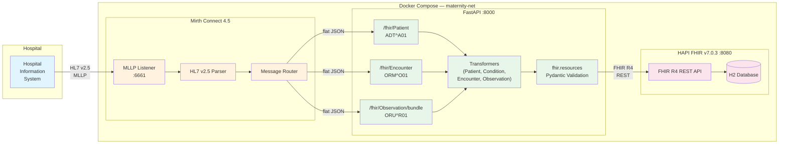

# Phase 9: Polish — README, Architecture Diagram, Demo Script

## Objective

Create a professional portfolio-quality README with architecture diagram, usage examples, and a demo script for recording a walkthrough GIF. The README is the first thing recruiters and hiring managers see — it must communicate competence, production-mindedness, and AU healthcare domain knowledge at a glance.

## Pre-conditions

- Phases 0–8 complete
- All 162 tests passing, 91%+ coverage
- Docker Compose with 3 services (Mirth, FastAPI, HAPI FHIR) functional
- Sample HL7 messages in `samples/`

## Task 1: Create `README.md`

**File**: `README.md` (project root)

Create a comprehensive README with the following sections in order:

```markdown
# Maternity HL7-to-FHIR Pipeline

> End-to-end HL7 v2.5 → FHIR R4 transformation pipeline for Australian maternity care, featuring Mirth Connect integration, AU Base profile conformance, and blood pressure panel merging.

[](https://github.com/<OWNER>/<REPO>/actions/workflows/ci.yml)

> **SYNTHETIC DATA ONLY** — All patient data in this repository is synthetic and generated for demonstration purposes. Not for clinical use.

## Architecture

<!-- Mermaid diagram — see Task 2 -->

## Data Flow

```
Hospital HIS → MLLP (port 6661) → Mirth Connect → HTTP POST → FastAPI → HAPI FHIR Server
                                    (parse HL7)     (transform)    (persist FHIR R4)
```

1. Hospital system sends HL7 v2.5 messages via MLLP to Mirth Connect
2. Mirth parses HL7 segments, extracts fields, routes flat JSON by message type
3. FastAPI receives JSON, builds FHIR R4 resources using `fhir.resources`, validates via Pydantic
4. Validated resources are persisted to HAPI FHIR Server via REST API
5. Correlation ID tracks each message end-to-end through structured JSON logs

## Message Types

| HL7 Message | Trigger | FHIR Resources | Key Segments |
|---|---|---|---|
| ADT^A01 | Patient admission | Patient + Condition(s) | PID, DG1 |
| ORM^O01 | Order placement | Encounter | PV1, ORC, OBR |
| ORU^R01 | Observation result | Observation(s) | OBX, OBR |

### Blood Pressure Panel Merging

Consecutive OBX segments with LOINC codes `8480-6` (systolic) and `8462-4` (diastolic) are automatically merged into a single FHIR Observation with:
- Panel code `85354-9` (Blood pressure panel)
- Two `component[]` entries (systolic + diastolic)
- AU Base blood pressure profile (`au-vitalsigns-bloodpressure`)
- Status = most conservative of the two readings
- Interpretation = worst-case non-normal flag

## Australian Healthcare Standards

| Standard | Detail |
|---|---|
| HL7 v2 | 2.5 |
| FHIR | R4 (4.0.1) |
| AU Base | 4.x profiles (Patient, Condition, Encounter, BP Observation) |
| IHI | `http://ns.electronichealth.net.au/id/hi/ihi/1.0` |
| MRN | `http://hospital.local/mrn` |
| ICD-10-AM | `http://hl7.org.au/fhir/CodeSystem/icd-10-am` |
| SNOMED CT | `http://snomed.info/sct` (AU edition) |
| LOINC | `http://loinc.org` |
| UCUM | `http://unitsofmeasure.org` |

## Quick Start

### Prerequisites

- Docker and Docker Compose v2
- Python 3.11+ (for local development and MLLP test client)

### Run

```bash
docker compose up --build
```

Services will be available at:
- **FastAPI**: http://localhost:8000
- **HAPI FHIR**: http://localhost:8080/fhir
- **Mirth Connect Admin**: https://localhost:8443
- **MLLP Listener**: port 6661

### Health Check

```bash
curl http://localhost:8000/health
```

Expected response:
```json
{"status": "ok", "hapi": "up", "version": "0.1.0"}
```

## Usage Examples

### 1. Admit a Patient (ADT^A01)

Send via MLLP:
```bash
python scripts/mllp_send.py samples/adt_a01_normal_delivery.hl7
```

Or directly to FastAPI:
```bash
curl -s -X POST http://localhost:8000/fhir/Patient \
  -H "Content-Type: application/json" \
  -H "X-Correlation-ID: demo-001" \
  -d '{
    "correlationId": "demo-001",
    "mrn": "1234567",
    "ihi": "8003608166690503",
    "name": {"family": "TEST", "given": "PATIENT", "middleName": "MARY", "prefix": "MS"},
    "birthDate": "19920315",
    "gender": "F",
    "address": {"line": "14 SAMPLE ST", "city": "SYDNEY", "state": "NSW", "postalCode": "2000", "country": "AUS"},
    "phone": "0412345678",
    "diagnoses": [{"code": "O80", "display": "Encounter for full-term uncomplicated delivery", "dateTime": "20260527093000"}]
  }'
```

Response:
```json
{"patientId": "1", "conditionIds": ["2"], "correlationId": "demo-001"}
```

### 2. Place an Order (ORM^O01)

```bash
python scripts/mllp_send.py samples/orm_o01_antenatal_28w.hl7
```

Or directly:
```bash
curl -s -X POST http://localhost:8000/fhir/Encounter \
  -H "Content-Type: application/json" \
  -H "X-Correlation-ID: demo-002" \
  -d '{
    "correlationId": "demo-002",
    "mrn": "1234567",
    "visitNumber": "VN00001",
    "patientClass": "I",
    "admitDatetime": "20260527093000",
    "location": {"ward": "MAT_WARD", "room": "301", "bed": "A"},
    "attendingDoctor": {"id": "DR_SMITH", "familyName": "SMITH", "givenName": "SARAH"},
    "orderControl": "NW"
  }'
```

### 3. Send Observations (ORU^R01)

```bash
python scripts/mllp_send.py samples/oru_r01_vitals.hl7
```

Or directly (with blood pressure panel):
```bash
curl -s -X POST http://localhost:8000/fhir/Observation/bundle \
  -H "Content-Type: application/json" \
  -H "X-Correlation-ID: demo-003" \
  -d '{
    "correlationId": "demo-003",
    "mrn": "1234567",
    "visitNumber": "VN00001",
    "observations": [
      {"setId": 1, "code": "8480-6", "display": "Systolic BP", "value": 118, "unitCode": "mm[Hg]", "status": "F"},
      {"setId": 2, "code": "8462-4", "display": "Diastolic BP", "value": 76, "unitCode": "mm[Hg]", "status": "F"},
      {"setId": 3, "code": "29463-7", "display": "Body weight", "value": 68.5, "unitCode": "kg", "status": "F"},
      {"setId": 4, "code": "11616-0", "display": "Fetal Heart Rate", "value": 145, "unitCode": "/min", "status": "F"}
    ]
  }'
```

### 4. Verify in HAPI FHIR

```bash
# All patients
curl -s http://localhost:8080/fhir/Patient | python -m json.tool

# Patient by MRN
curl -s "http://localhost:8080/fhir/Patient?identifier=http://hospital.local/mrn|1234567"

# All observations for a patient
curl -s "http://localhost:8080/fhir/Observation?patient=1"

# Blood pressure observations only
curl -s "http://localhost:8080/fhir/Observation?code=85354-9"
```

## API Endpoints

| Method | Path | Purpose |
|---|---|---|
| `GET` | `/health` | Health check (FastAPI + HAPI status) |
| `POST` | `/fhir/Patient` | ADT flat JSON → Patient + Condition(s) |
| `POST` | `/fhir/Encounter` | ORM flat JSON → Encounter |
| `POST` | `/fhir/Observation/bundle` | ORU observations → Observation(s) with BP merge |

## Error Handling

- **Validation errors** → `422` with RFC 7807 `application/problem+json` body
- **HAPI FHIR errors** → `502` with problem+json + dead-letter file
- **Unhandled errors** → `500` with problem+json
- Dead-letter files saved to `./deadletter/` with correlation ID prefix

## Testing

```bash
# Install dev dependencies
cd fastapi && pip install ".[dev]"

# Run all tests with coverage
cd .. && python -m pytest tests/ -v --cov=fastapi/app --cov-report=term-missing --cov-fail-under=80

# Unit tests only
python -m pytest tests/unit/ -v

# Integration tests only
python -m pytest tests/integration/ -v

# Lint
cd fastapi && ruff check app/

# Type check
cd fastapi && mypy app/ --ignore-missing-imports
```

**Coverage**: 162 tests (144 unit + 18 integration), 91% line coverage.

## Project Structure

```
maternity-hl7-to-fhir/
├── docker-compose.yml              # 3-service orchestration
├── fastapi/
│   ├── Dockerfile
│   ├── pyproject.toml
│   └── app/
│       ├── main.py                 # FastAPI routes + lifespan
│       ├── config.py               # pydantic-settings (env vars)
│       ├── errors.py               # RFC 7807 problem+json
│       ├── logging_setup.py        # Structured JSON logging
│       ├── middleware.py           # X-Correlation-ID middleware
│       ├── models/                 # Pydantic payload models
│       │   ├── adt_payload.py      #   ADT^A01 input
│       │   ├── orm_payload.py      #   ORM^O01 input
│       │   └── oru_payload.py      #   ORU^R01 input
│       ├── transformers/           # HL7 → FHIR mapping
│       │   ├── patient.py          #   → Patient resource
│       │   ├── condition.py        #   → Condition resource
│       │   ├── encounter.py        #   → Encounter resource
│       │   └── observation.py      #   → Observation (+ BP panel)
│       ├── clients/                # HAPI FHIR client
│       │   ├── hapi_client.py      #   Upsert/create + profile seeding
│       │   ├── patient_resolver.py #   MRN → Patient ID lookup
│       │   └── encounter_resolver.py # Visit# → Encounter ID lookup
│       └── valuesets/              # Terminology mappings
│           ├── hl7_to_fhir_gender.py
│           ├── hl7_to_fhir_encounter.py
│           └── hl7_to_fhir_observation.py
├── hapi/
│   ├── Dockerfile                  # HAPI FHIR v7.0.3
│   ├── application.yaml
│   └── HealthCheck.java
├── mirth/
│   ├── channels/                   # Mirth channel XML configs
│   └── code_templates/
├── samples/                        # Synthetic HL7 messages
│   ├── adt_a01_normal_delivery.hl7
│   ├── orm_o01_antenatal_28w.hl7
│   ├── oru_r01_vitals.hl7
│   └── invalid/
│       └── adt_missing_mrn.hl7
├── scripts/
│   ├── mllp_send.py               # MLLP test client
│   └── reset.sh                   # Full reset (down -v + clean)
├── tests/
│   ├── unit/                      # 144 unit tests
│   └── integration/               # 18 integration tests
├── deadletter/                    # Failed message store (gitignored)
├── logs/                          # Runtime logs (gitignored)
└── .github/workflows/ci.yml      # CI: lint + type check + test
```

## Tech Stack

- **Python 3.11**, FastAPI, Pydantic v2, `fhir.resources`
- **Mirth Connect 4.5** — MLLP listener, HL7 v2.5 parser
- **HAPI FHIR Server v7.0.3** — FHIR R4 persistence
- **Docker Compose** — orchestration
- **pytest** + **respx** — testing with async HTTP mocking
- **ruff** — linting, **mypy --strict** — type checking
- **httpx** — async HTTP client

## Key Design Decisions

| Decision | Rationale |
|---|---|
| Conditional PUT for idempotency | Re-sending same HL7 message produces no duplicates |
| FHIR Transaction Bundles | Atomic multi-resource submission (Patient + Conditions) |
| BP panel merging | Consecutive systolic/diastolic OBX → single BP Observation per clinical convention |
| RFC 7807 error responses | Standard problem+json for interoperability |
| Dead-letter queue | Failed messages preserved for debugging/replay |
| Correlation ID propagation | UUID in `X-Correlation-ID` header, logged everywhere |
| No PHI in logs | Only identifiers at INFO level, never names/DOB |
| AU Base profiles | Explicit `meta.profile` on Patient, Condition, Encounter, BP Observation |
| AEST datetime output | All FHIR datetimes include `+10:00` timezone offset |

## License

MIT
```

**Important notes for the README**:
- Replace `<OWNER>/<REPO>` in the CI badge URL with the actual GitHub owner/repo once known. Leave as placeholder for now.
- All curl examples use the actual payload shapes that main.py expects.
- The observation curl example mirrors the fixture in `tests/fixtures/oru_r01_payload.json`.
- Project structure reflects the actual file tree (verified).
- Coverage numbers are current (162 tests, 91%).

## Task 2: Create Architecture Diagram (Mermaid in README)

**Location**: Embedded in README.md under the `## Architecture` section

Insert this Mermaid diagram:

````markdown

````

## Task 3: Create Demo Script

**File**: `scripts/demo.sh`

A scripted demo that sends all 3 message types in order, with pauses and output, suitable for recording with `asciinema` or `terminalizer`.

```bash
#!/usr/bin/env bash
set -euo pipefail

# Demo script for Maternity HL7-to-FHIR Pipeline
# Usage: ./scripts/demo.sh
# Recording: asciinema rec demo.cast -c "./scripts/demo.sh"

API="http://localhost:8000"
HAPI="http://localhost:8080/fhir"

GREEN='\033[0;32m'
BLUE='\033[0;34m'
YELLOW='\033[1;33m'
NC='\033[0m'

pause() { echo ""; read -r -p "Press Enter to continue..."; echo ""; }

echo -e "${BLUE}╔══════════════════════════════════════════════════════╗${NC}"
echo -e "${BLUE}║  Maternity HL7-to-FHIR Pipeline — Live Demo         ║${NC}"
echo -e "${BLUE}║  SYNTHETIC DATA ONLY — Not for clinical use          ║${NC}"
echo -e "${BLUE}╚══════════════════════════════════════════════════════╝${NC}"
echo ""

# Step 0: Health check
echo -e "${YELLOW}[0/4] Health Check${NC}"
echo "curl $API/health"
curl -s "$API/health" | python3 -m json.tool
pause

# Step 1: Admit patient (ADT^A01)
echo -e "${YELLOW}[1/4] Admitting Patient — ADT^A01 → Patient + Condition${NC}"
echo -e "Message: samples/adt_a01_normal_delivery.hl7"
echo ""
curl -s -X POST "$API/fhir/Patient" \
  -H "Content-Type: application/json" \
  -H "X-Correlation-ID: demo-001" \
  -d '{
    "correlationId": "demo-001",
    "mrn": "1234567",
    "ihi": "8003608166690503",
    "name": {"family": "TEST", "given": "PATIENT", "middleName": "MARY", "prefix": "MS"},
    "birthDate": "19920315",
    "gender": "F",
    "address": {"line": "14 SAMPLE ST", "city": "SYDNEY", "state": "NSW", "postalCode": "2000", "country": "AUS"},
    "phone": "0412345678",
    "diagnoses": [{"code": "O80", "display": "Encounter for full-term uncomplicated delivery", "dateTime": "20260527093000"}]
  }' | python3 -m json.tool
echo ""
echo -e "${GREEN}✓ Patient + Condition created in HAPI FHIR${NC}"
pause

# Step 2: Place order (ORM^O01)
echo -e "${YELLOW}[2/4] Placing Order — ORM^O01 → Encounter${NC}"
echo -e "Message: samples/orm_o01_antenatal_28w.hl7"
echo ""
curl -s -X POST "$API/fhir/Encounter" \
  -H "Content-Type: application/json" \
  -H "X-Correlation-ID: demo-002" \
  -d '{
    "correlationId": "demo-002",
    "mrn": "1234567",
    "visitNumber": "VN00001",
    "patientClass": "I",
    "admitDatetime": "20260527093000",
    "location": {"ward": "MAT_WARD", "room": "301", "bed": "A"},
    "attendingDoctor": {"id": "DR_SMITH", "familyName": "SMITH", "givenName": "SARAH"},
    "orderControl": "NW"
  }' | python3 -m json.tool
echo ""
echo -e "${GREEN}✓ Encounter created in HAPI FHIR${NC}"
pause

# Step 3: Send observations (ORU^R01) with BP panel
echo -e "${YELLOW}[3/4] Sending Observations — ORU^R01 → Observations (with BP panel merge)${NC}"
echo -e "Message: samples/oru_r01_vitals.hl7"
echo -e "BP panel: systolic (8480-6) + diastolic (8462-4) → merged panel (85354-9)"
echo ""
curl -s -X POST "$API/fhir/Observation/bundle" \
  -H "Content-Type: application/json" \
  -H "X-Correlation-ID: demo-003" \
  -d '{
    "correlationId": "demo-003",
    "mrn": "1234567",
    "visitNumber": "VN00001",
    "observations": [
      {"setId": 1, "code": "8480-6", "display": "Systolic BP", "value": 118, "unitCode": "mm[Hg]", "status": "F"},
      {"setId": 2, "code": "8462-4", "display": "Diastolic BP", "value": 76, "unitCode": "mm[Hg]", "status": "F"},
      {"setId": 3, "code": "29463-7", "display": "Body weight", "value": 68.5, "unitCode": "kg", "status": "F"},
      {"setId": 4, "code": "11616-0", "display": "Fetal Heart Rate", "value": 145, "unitCode": "/min", "status": "F"}
    ]
  }' | python3 -m json.tool
echo ""
echo -e "${GREEN}✓ 3 Observations created (1 BP panel + 2 individual)${NC}"
pause

# Step 4: Verify in HAPI FHIR
echo -e "${YELLOW}[4/4] Verifying Resources in HAPI FHIR${NC}"
echo ""

echo -e "${BLUE}Patient:${NC}"
curl -s "$HAPI/Patient?identifier=http://hospital.local/mrn|1234567" | python3 -c "
import json, sys
bundle = json.load(sys.stdin)
for entry in bundle.get('entry', []):
    r = entry['resource']
    name = r.get('name', [{}])[0]
    print(f\"  ID: {r['id']}  Name: {name.get('family', '?')}, {name.get('given', ['?'])[0]}  Gender: {r.get('gender', '?')}\")
"

echo -e "${BLUE}Conditions:${NC}"
curl -s "$HAPI/Condition" | python3 -c "
import json, sys
bundle = json.load(sys.stdin)
for entry in bundle.get('entry', []):
    r = entry['resource']
    code = r.get('code', {}).get('coding', [{}])[0]
    print(f\"  ID: {r['id']}  Code: {code.get('code', '?')} — {code.get('display', '?')}\")
"

echo -e "${BLUE}Encounters:${NC}"
curl -s "$HAPI/Encounter" | python3 -c "
import json, sys
bundle = json.load(sys.stdin)
for entry in bundle.get('entry', []):
    r = entry['resource']
    print(f\"  ID: {r['id']}  Status: {r.get('status', '?')}  Class: {r.get('class', {}).get('code', '?')}\")
"

echo -e "${BLUE}Observations:${NC}"
curl -s "$HAPI/Observation" | python3 -c "
import json, sys
bundle = json.load(sys.stdin)
for entry in bundle.get('entry', []):
    r = entry['resource']
    code = r.get('code', {}).get('coding', [{}])[0]
    val = r.get('valueQuantity', {})
    comp = r.get('component', [])
    if comp:
        parts = ', '.join(f\"{c['code']['coding'][0]['display']}: {c['valueQuantity']['value']}\" for c in comp)
        print(f\"  ID: {r['id']}  {code.get('display', '?')} (panel: {parts})\")
    elif val:
        print(f\"  ID: {r['id']}  {code.get('display', '?')}: {val.get('value', '?')} {val.get('unit', '')}\")
    else:
        print(f\"  ID: {r['id']}  {code.get('display', '?')}\")
"

echo ""
echo -e "${GREEN}╔══════════════════════════════════════════════════════╗${NC}"
echo -e "${GREEN}║  Demo complete — all FHIR resources persisted ✓      ║${NC}"
echo -e "${GREEN}╚══════════════════════════════════════════════════════╝${NC}"
```

Mark executable: `chmod +x scripts/demo.sh`

## Task 4: Create `LICENSE`

**File**: `LICENSE` (project root)

MIT License with current year and author placeholder:

```
MIT License

Copyright (c) 2026 <AUTHOR_NAME>

Permission is hereby granted, free of charge, to any person obtaining a copy
of this software and associated documentation files (the "Software"), to deal
in the Software without restriction, including without limitation the rights
to use, copy, modify, merge, publish, distribute, sublicense, and/or sell
copies of the Software, and to permit persons to whom the Software is
furnished to do so, subject to the following conditions:

The above copyright notice and this permission notice shall be included in all
copies or substantial portions of the Software.

THE SOFTWARE IS PROVIDED "AS IS", WITHOUT WARRANTY OF ANY KIND, EXPRESS OR
IMPLIED, INCLUDING BUT NOT LIMITED TO THE WARRANTIES OF MERCHANTABILITY,
FITNESS FOR A PARTICULAR PURPOSE AND NONINFRINGEMENT. IN NO EVENT SHALL THE
AUTHORS OR COPYRIGHT HOLDERS BE LIABLE FOR ANY CLAIM, DAMAGES OR OTHER
LIABILITY, WHETHER IN AN ACTION OF CONTRACT, TORT OR OTHERWISE, ARISING FROM,
OUT OF OR IN CONNECTION WITH THE SOFTWARE OR THE USE OR OTHER DEALINGS IN THE
SOFTWARE.
```

Replace `<AUTHOR_NAME>` with actual name.

## Task 5: Create `.env.example`

**File**: `.env.example` (project root)

Document the environment variables used by docker-compose:

```env
# Maternity HL7-to-FHIR Pipeline — Environment Configuration
# Copy this file to .env and adjust values as needed.

# FastAPI Configuration
HAPI_BASE_URL=http://hapi:8080/fhir
LOG_LEVEL=INFO
MRN_SYSTEM=http://hospital.local/mrn
IHI_SYSTEM=http://ns.electronichealth.net.au/id/hi/ihi/1.0

# HAPI FHIR Configuration
# Database: H2 (embedded) for demo — swap to Postgres for production
# See hapi/application.yaml for additional HAPI settings
```

## Task 6: Add Demo Recording Instructions to README

Append to the README, before the License section:

```markdown
## Demo

### Run the Interactive Demo

```bash
# Ensure services are running
docker compose up -d

# Run the demo script
./scripts/demo.sh
```

### Record a Demo GIF

```bash
# Install asciinema
pip install asciinema

# Record
asciinema rec demo.cast -c "./scripts/demo.sh"

# Convert to GIF (requires agg: https://github.com/asciinema/agg)
agg demo.cast demo.gif
```
```

## Task 7: Verify All Links and Examples

After creating files, verify:

1. **README renders correctly**: Check Mermaid diagram syntax is valid
2. **Curl examples match actual payloads**: Compare against `fastapi/app/models/adt_payload.py`, `orm_payload.py`, `oru_payload.py`
3. **Project structure in README matches actual**: Run `find . -not -path './.git/*' -not -path './venv/*' -not -path './.claude/*' -not -path './.codex/*' -not -path './.agents/*' -not -path './__pycache__/*' -not -path '*.pyc' | sort`
4. **Test counts current**: 162 total, 91% coverage
5. **All file paths referenced exist**

## Verification

```bash
# README exists and has content
wc -l README.md
# Expected: ~300+ lines

# License exists
cat LICENSE | head -1
# Expected: "MIT License"

# Demo script exists and is executable
ls -la scripts/demo.sh
# Expected: -rwxr-xr-x

# .env.example exists
cat .env.example

# Mermaid diagram renders (check on GitHub or use mermaid-cli)
# npx @mermaid-js/mermaid-cli mmdc -i README.md -o /dev/null 2>&1 || echo "Check Mermaid syntax manually"

# All tests still pass (no regressions)
python -m pytest tests/ -v --cov=fastapi/app --cov-fail-under=80
```

## Definition of Done

- [ ] `README.md` exists with all sections (Architecture, Data Flow, Message Types, Standards, Quick Start, Usage, API, Errors, Testing, Structure, Tech Stack, Design Decisions, Demo, License)
- [ ] Mermaid architecture diagram renders correctly on GitHub
- [ ] All curl examples use valid payloads matching Pydantic models
- [ ] `scripts/demo.sh` exists, is executable, runs end-to-end when services are up
- [ ] `LICENSE` file exists (MIT)
- [ ] `.env.example` documents all environment variables
- [ ] CI badge placeholder is in README (to be updated with real URL)
- [ ] No test regressions — all 162 tests still pass
- [ ] Synthetic data disclaimer is prominent

## Notes for Next Phase

- **Phase 10 (Stretch)**: AU Core validation via HAPI `$validate` endpoint
- After pushing to GitHub: update CI badge URL, add demo GIF to README
- Consider adding `CONTRIBUTING.md` if making the repo public
